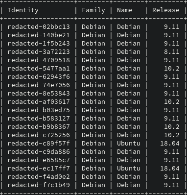
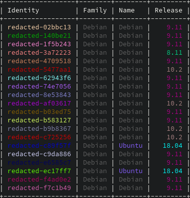

# Skittlize

[](https://travis-ci.com/smortex/skittlize)

Humans are bad at spotting differences in similar text strings.  Help them with colors!  Each skittlized String is colored base on the content of the text itself, making it easier to spot recurring words in a bunch of data.  This is particullary useful when processing reports formatted as tables in text.

 

## Installation

Add this line to your application's Gemfile:

```ruby
gem 'skittlize'
```

And then execute:

    $ bundle

Or install it yourself as:

    $ gem install skittlize

## Usage

```ruby
require 'skittlize'

puts "keyword".skittlize

table = [
  ['3.14', '3.24', '3.34'],
  ['3.34', '3.17', '3.24'],
  ['3.17', '3.34', '3.14'],
  ['3.17', '3.24', '3.14'],
  ['3.34', '3.24', '3.34'],
]
table.skittlize!

table.each do |line|
  puts line.join(' ')
end
```

## Development

After checking out the repo, run `bin/setup` to install dependencies. Then, run `rake spec` to run the tests. You can also run `bin/console` for an interactive prompt that will allow you to experiment.

To install this gem onto your local machine, run `bundle exec rake install`. To release a new version, update the version number in `version.rb`, and then run `bundle exec rake release`, which will create a git tag for the version, push git commits and tags, and push the `.gem` file to [rubygems.org](https://rubygems.org).

## Contributing

Bug reports and pull requests are welcome on GitHub at https://github.com/smortex/skittlize. This project is intended to be a safe, welcoming space for collaboration, and contributors are expected to adhere to the [Contributor Covenant](http://contributor-covenant.org) code of conduct.

## License

The gem is available as open source under the terms of the [MIT License](https://opensource.org/licenses/MIT).

## Code of Conduct

Everyone interacting in the Skittlize project’s codebases, issue trackers, chat rooms and mailing lists is expected to follow the [code of conduct](https://github.com/smortex/skittlize/blob/master/CODE_OF_CONDUCT.md).
